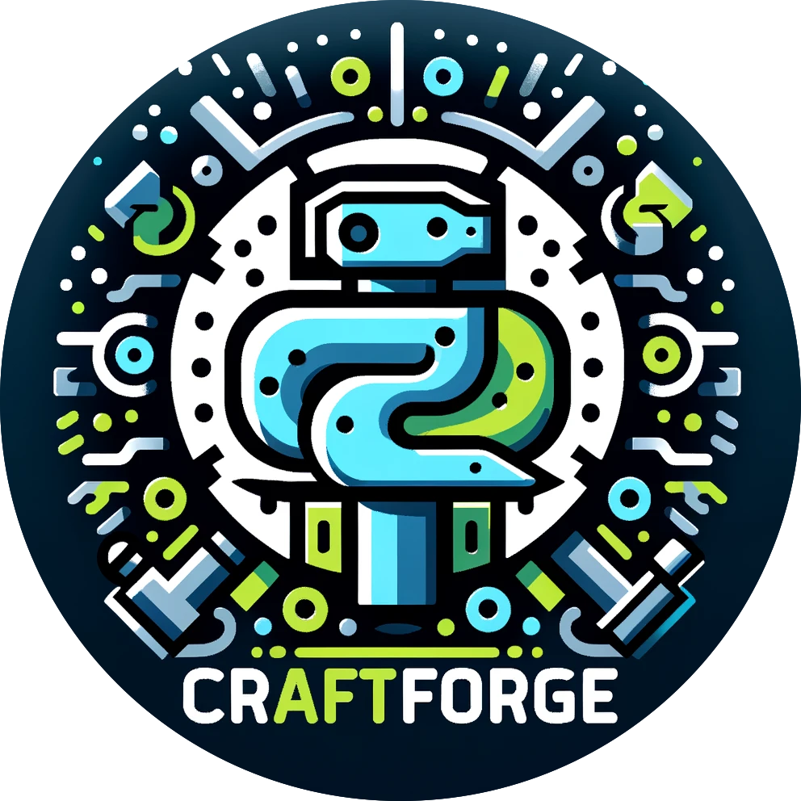

<a name="readme-top"></a>

[![Contributors][contributors-shield]][contributors-url]
[![Forks][forks-shield]][forks-url]
[![Stargazers][stars-shield]][stars-url]
[![Issues][issues-shield]][issues-url]
[![MIT License][license-shield]][license-url]

<!-- PROJECT LOGO -->
<br />
<div align="center">
    
  <h3 align="center">CraftForge</h3>
  <p align="center">
    Yet Another Application Framework Layer for Proof of Concept
    <br />
    <a href="https://github.com/hamatz/chatgpt_minimal_starter_kit/issues">Report Bug</a>
    ·
    <a href="https://github.com/hamatz/chatgpt_minimal_starter_kit/issues">Request Feature</a>
  </p>
</div>

<!-- ABOUT THE PROJECT -->
## About The Project : 
[![CraftForge Screen Shot][product-screenshot]](https://github.com/hamatz/chatgpt_minimal_starter_kit)

### CraftForge: 開発の革命を加速する魔法の道具箱  
#### ～社内の制約を超えて、イノベーションを加速する革新的フレームワーク～

### イントロダクション
現代のソフトウェア開発の世界では、イノベーションがすべてです。しかし、多くの企業にとって、環境の制約はイノベーションを難しいものにしています。ペースの速い開発の世界で常に先行するには、こうした制約を打ち破るツールが必要不可欠です。そこで登場するのが`CraftForge`、ゲームのルールを変える革新的なアプリケーションフレームワークです。

## 問題提起
制約の多い企業環境で働く開発者にとって、新しいアイデアを限られたメンバー間で実験することすら困難を極めます。厳格なセキュリティプロトコルや、プロトタイプ配布の際にすら強いられる無駄に長いレビュープロセスなど、創造性を阻害する環境に直面することがよくあります。

## CraftForgeのソリューション
`CraftForge`はプラグインベースのアーキテクチャを採用することで、これらの問題に真正面から取り組みます。モノリシックなアプリケーションの代わりに、`CraftForge`では開発者が小さな再利用可能なプラグインを作成し、共有することができます。これらのプラグインはzipファイルの形で構成されており、中身はただのテキストファイルですので、従来のような長い承認プロセスを必要とせず、簡単にインストールおよび更新ができます。

`CraftForge`の中核をなすのが`IntentConductor`です。これは、プラグイン間のシームレスなコミュニケーションと機能の共有を可能にするシステムです。「あのアプリの素敵なUIコンポーネントを使いたい」「あのアプリのデータ処理機能を借りたい」といった要望を、`IntentConductor`が実現します。

## 内部構造
`CraftForge`は`Python`で構築されています。`Python`は読みやすさと緩やかな学習曲線で知られる言語であり、プログラミングの専門家でなくてもコードを理解し、修正することができます。これは、企業向けソフトウェアの世界では珍しい、オープンさと透明性のレベルです。ユーザーは受動的にアプリを使うだけでなく、能動的に参加することができ、イノベーションを加速するための重要な要素だと考えています。

デプロイメントについて、現在でも企業環境で業務用PCに`Python`をインストールして環境を構築するには、セキュリティ上の制約など高いハードルがあります。`CraftForge`は、`Python`のランタイム環境をアプリケーションと一緒にパッケージ化することでこれらを解決しています。別途のインストールや複雑なセットアップ手順は必要ありません。

## 実際の影響
開発者所属先の業務でも`CraftForge`を一部導入済みですが、すでにその恩恵を実感しつつあります。

これまでは、新しいプロトタイプを作っても私の開発用マシン上でしか動作せず、デモの時以外は他のメンバーがそれを触る機会すらありませんでした。例えば`ChatGPT`のレスポンスを使って別のプロンプトを生成するような処理を何度か繰り返す程度の簡単なアプリケーションでも、そのプロンプトのテンプレートの編集すらメンバー側ではできない非効率な状況でした。

しかし、`CraftForge`を導入したことにより、プロンプトのテンプレートの編集はもちろん、一部の処理をコメントアウトするなどの作業であればエンドユーザー側で簡単にできるようになりました。ユーザー側で思いついたことを試すハードルが下がり、トライ＆エラーのサイクルを回す速度が劇的に向上しただけでなく、開発者側のサポート負担も減り、新しい機能の追加にフォーカスできるようになりました。

また、`IntentConductor`を活用することで、再利用可能な単機能特化のプラグインを作るアプローチに変わり、`CraftForge`自身の開発スピードも大きく加速しています。例えば、あるプラグインが依存関係を持つプラグインを一括してインストールする`Dependency Install`の機能は半日で開発されました。

このように、`CraftForge`はゲームチェンジャーであり、かつてないスピードでイノベーションを加速し、新しいアイデアを現場に投入することを可能にします。

## 未来
今後の展開については、以下のようなことを検討中です。

- プラグイン側で import 可能なライブラリの増強
- コミュニティ間でプラグインを共有するためのサーバーの整備 
- 多言語対応
- AI assistance の強化（プラグイン開発のサポート、ドキュメンテーションの自動生成など）
- クラウドサービスとの統合

これらは現時点での計画ですが、`CraftForge`は常に進化を続けていくことだけは確かです。

## 結論
`CraftForge`は単なるアプリケーションフレームワーク以上のものです。それは開発者をこれまで長きにわたって制約してきた束縛から解き放つための手段なのです。`CraftForge`はまだ初期のステージですが、大きな可能性を秘めていると考えています。`CraftForge`の活動に参加し、開発の自由の新時代を一緒に切り開いていただける方々、ぜひご連絡ください！


<p align="right">(<a href="#readme-top">back to top</a>)</p>


### Built With

<a href="https://flet.dev/">

</a>

<p align="right">(<a href="#readme-top">back to top</a>)</p>


<!-- GETTING STARTED -->
## Getting Started

### Prerequisites

依存関係のある以下のライブラリをインストールします

  ```sh
  pip install flet
  pip install cryptography
  pip install openai
  pip install langchain
  pip install qdrant_client
  pip install tiktoken
  pip install pypdf2
  pip install pyinstaller
  ```

  または

```sh
pip install requirements.txt
```

### Installation


1. Clone the repo
   ```sh
   git clone https://github.com/hamatz/chatgpt_minimal_starter_kit.git
   ```
2. Run the app with flet
   ```sh
   flet run app.py
   ```

### Build as exe file

1. Build the app
   ```sh
   chmod +x build_on_mac.sh
   ./build_on_mac.sh
   or
   ./build_on_win.ps1
   ```
2. hidden import 等を解決した形でビルドしなおしたい場合
   ```sh
   pyinstaller app.spec --clean
   ```


### 関連ドキュメント

- [プラグイン開発者向けマニュアル](https://github.com/hamatz/chatgpt_minimal_starter_kit/blob/main/doc/developer_manual.md)


<p align="right">(<a href="#readme-top">back to top</a>)</p>


## CraftForgeが目指す活用シーン

1. **社内のイノベーションサイクルを加速** : CraftForgeは、技術的障壁を取り除き、アイデアから実装までのプロセスを簡素化します。zipファイルによるプラグインの簡単な共有と導入は、新しい機能の迅速なテストとチーム内での共有を可能にし、イノベーションサイクルを大幅に加速させます。このプロセスにより、イノベーションへのアプローチが劇的に簡易化され、社内での新しいアイデア試行の敷居が低くなります。

2. **教育とトレーニング** : 社内教育やトレーニングプログラムでCraftForgeを活用し、実践的な学習ツールとして使用します。プログラミングやアプリケーション開発の基本から、具体的なビジネスケースのシミュレーションまで、幅広い用途に対応できます

3. **顧客向けPoCの迅速な提供** : さまざまなアイデアの検証に対して迅速に応えるカスタマイズサービスの提供にCraftForgeを利用します。顧客の要望に基づいた迅速なソリューションの開発が可能となり、アイデア検証のループを高速に回すことで顧客満足度の向上とともに差別化を図ります


<p align="right">(<a href="#readme-top">back to top</a>)</p>


<!-- CONTRIBUTING -->
## Contributing

Contributions are what make the open source community such an amazing place to learn, inspire, and create. Any contributions you make are **greatly appreciated**.

If you have a suggestion that would make this better, please fork the repo and create a pull request. You can also simply open an issue with the tag "enhancement".
Don't forget to give the project a star! Thanks again!

1. Fork the Project
2. Create your Feature Branch (`git checkout -b feature/AmazingFeature`)
3. Commit your Changes (`git commit -m 'Add some AmazingFeature'`)
4. Push to the Branch (`git push origin feature/AmazingFeature`)
5. Open a Pull Request

<p align="right">(<a href="#readme-top">back to top</a>)</p>


<!-- LICENSE -->
## License

Distributed under the MIT License. See `LICENSE.txt` for more information.

<p align="right">(<a href="#readme-top">back to top</a>)</p>

<!-- MARKDOWN LINKS & IMAGES -->
<!-- https://www.markdownguide.org/basic-syntax/#reference-style-links -->
[contributors-shield]: https://img.shields.io/github/contributors/hamatz/chatgpt_minimal_starter_kit.svg?style=for-the-badge
[contributors-url]: https://github.com/hamatz/chatgpt_minimal_starter_kit/graphs/contributors
[forks-shield]: https://img.shields.io/github/forks/hamatz/chatgpt_minimal_starter_kit.svg?style=for-the-badge
[forks-url]: https://github.com/hamatz/chatgpt_minimal_starter_kit/network/members
[stars-shield]: https://img.shields.io/github/stars/hamatz/chatgpt_minimal_starter_kit.svg?style=for-the-badge
[stars-url]: https://github.com/hamatz/chatgpt_minimal_starter_kit/stargazers
[issues-shield]: https://img.shields.io/github/issues/hamatz/chatgpt_minimal_starter_kit.svg?style=for-the-badge
[issues-url]: https://github.com/hamatz/chatgpt_minimal_starter_kit/issues
[license-shield]: https://img.shields.io/github/license/hamatz/chatgpt_minimal_starter_kit.svg?style=for-the-badge
[license-url]: https://github.com/hamatz/chatgpt_minimal_starter_kit/blob/master/LICENSE.txt
[product-screenshot]: doc/img/demo.gif
