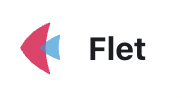

<a name="readme-top"></a>

[![Contributors][contributors-shield]][contributors-url]
[![Forks][forks-shield]][forks-url]
[![Stargazers][stars-shield]][stars-url]
[![Issues][issues-shield]][issues-url]
[![MIT License][license-shield]][license-url]

<!-- PROJECT LOGO -->
<br />
<div align="center">
    
  <h3 align="center">CraftForge</h3>
  <p align="center">
    Yet Another Application Framework Layer for Proof of Concept
    <br />
    <a href="https://github.com/hamatz/chatgpt_minimal_starter_kit/issues">Report Bug</a>
    ·
    <a href="https://github.com/hamatz/chatgpt_minimal_starter_kit/issues">Request Feature</a>
  </p>
</div>

<!-- ABOUT THE PROJECT -->
## About The Project : アイデアを即座に形にする、革新的なオープンソースプラットフォーム
[![CraftForge Screen Shot][product-screenshot]](https://github.com/hamatz/chatgpt_minimal_starter_kit)

CraftForgeは、Fletフレームワークを基盤とした、ユニークなデスクトップアプリケーションプラットフォームです。私たちのミッションは、誰もが自由に創造性を発揮し、アイデアを素早く形にできる環境を提供することです。

CraftForgeが採用しているのは、Pythonというプログラミング言語。高校生の教科書でも使われるなど、今後も広く利用者の多い言語であると考えられている点を重視したからです。また、Pythonを選択したもう一つの大きな理由は、作られたプラグインがバイナリの形式にならず、ユーザーからコードがそのまま見えることにあります。これにより、学習や手元でのカスタマイズに最適な環境が実現するのです。プログラミングを学ぶ学生や、自分好みにアプリケーションを改造したいユーザーにとって、CraftForgeは理想的なプラットフォームになると考えています。

また、CraftForgeの最大の強みは、新しい機能をzipファイルという形で追加できるということ。メールに添付したり、チャットで共有したりするだけで、誰もが簡単にプラグインをインストールできるのです。ITの専門知識は必要ありません。アイデアを着想してから、実際に手元で動作するアプリケーションになるまでの時間が圧倒的に短縮されます。これにより、Try&Errorの繰り返し回数を最大化できます。現代のビジネス環境で競争優位を保つためには、このスピードが非常に重要なのです。

企業内でexe形式のアプリケーションを配布しようとすると、承認までのハードルが非常に高く、長い時間を待たされることがよくあります。セキュリティチェックや動作検証、互換性の確認など、クリアしなければならない課題が山積みなのです。アイデアを着想しても、実際に手元で動作するアプリケーションになるまでに、数週間、あるいは数ヶ月もかかってしまうことも珍しくありません。

では、クラウド上でWebアプリケーションを構築すれば、この問題は解決するのでしょうか？残念ながら、そう簡単ではありません。クラウドベースのアプリケーション開発には、多くの時間と費用がかかります。インフラの設計、セキュリティ対策、スケーラビリティの確保など、考慮しなければならない点が数多くあるのです。さらに、運用時のコストも無視できません。サーバーの維持、モニタリング、トラブルシューティングなど、継続的な努力が必要となります。

しかし、CraftForgeなら、これらの問題を一挙に解決できるのです。ローカル環境で動作するデスクトップアプリケーションとして、インフラ構築や運用の手間を大幅に削減できます。また、zipファイルでの機能追加により、アイデアの共有と展開のスピードが格段に向上します。

CraftForgeは、エンドユーザーコンピューティングの理念を体現しています。他の人が作ったアプリケーションのソースコードを実際に見ながら勉強したり、それを改造して自分の好みにカスタマイズしたりできるのです。これこそが、真のデジタルトランスフォーメーション（DX）に必要な要素だと私たちは考えています。グローバルに1つのソフトウェアを開発し、ユーザーの要望全てに応えようとするのは不可能です。だからこそ、私たちはCraftForgeという方向性を選択したのです。

想像してみてください。Pythonを使って独自のアプリケーションを開発し、それをzipファイルにまとめるだけ。あとは、そのファイルを同僚や友人と共有するだけで、アイデアが瞬時に広がっていく。そんな世界が、もう目の前に広がっているのです。

プラグイン開発者の方々も、安心してください。CraftForgeは、UIコンポーネントをシステム全体で共有しているので、あなたはロジックの開発に集中できます。しかも、APIレイヤーが機密情報を守ってくれるから、プラグイン配布時にアクセストークン等のセンシティブな情報を含める必要がなく、セキュリティの心配もありません。

CraftForgeは、オープンソースのエコシステムを通じて、コラボレーションとコミュニティを育成します。あなたのアイデアを共有し、他の人の作品から学び、一緒に成長していく...それがCraftForgeの目指す世界です。

社内のイノベーションを加速させたい、リモートワークのコラボレーションを強化したい、顧客向けのPoCを迅速に提供したい...CraftForgeは、あらゆるシーンであなたのビジネスを支えます。

さあ、CraftForgeの世界に飛び込んで、あなたの創造性を解き放ちましょう！私たちと一緒に、テクノロジーの未来を切り拓いていきませんか？

アイデアを即座に形にできる喜びを、ぜひ体験してください。CraftForgeは、いつでもあなたを待っています。Let's craft the future together!


> [!NOTE]  
>本プロジェクトはまだ初期ステージであり、自由にご活用いただくにはもう少しお時間が必要となっておりますので、しばらくお待ちいただけますと幸いです 


<p align="right">(<a href="#readme-top">back to top</a>)</p>


### Built With

<a href="https://flet.dev/">

</a>

<p align="right">(<a href="#readme-top">back to top</a>)</p>


<!-- GETTING STARTED -->
## Getting Started

### Prerequisites

依存関係のある以下のライブラリをインストールします

  ```sh
  pip install flet
  pip install cryptography
  pip install openai
  pip install langchain
  pip install qdrant_client
  ```

### Installation


1. Clone the repo
   ```sh
   git clone https://github.com/hamatz/chatgpt_minimal_starter_kit.git
   ```
2. Run the app with flet
   ```sh
   flet run app.py
   ```

<p align="right">(<a href="#readme-top">back to top</a>)</p>


## CraftForgeが目指す活用シーン

1. **社内のイノベーションサイクルを加速** : CraftForgeは、技術的障壁を取り除き、アイデアから実装までのプロセスを簡素化します。zipファイルによるプラグインの簡単な共有と導入は、新しい機能の迅速なテストとチーム内での共有を可能にし、イノベーションサイクルを大幅に加速させます。このプロセスにより、イノベーションへのアプローチが劇的に簡易化され、社内での新しいアイデア試行の敷居が低くなります。

2. **教育とトレーニング** : 社内教育やトレーニングプログラムでCraftForgeを活用し、実践的な学習ツールとして使用します。プログラミングやアプリケーション開発の基本から、具体的なビジネスケースのシミュレーションまで、幅広い用途に対応できます

3. **顧客向けPoCの迅速な提供** : さまざまなアイデアの検証に対して迅速に応えるカスタマイズサービスの提供にCraftForgeを利用します。顧客の要望に基づいた迅速なソリューションの開発が可能となり、アイデア検証のループを高速に回すことで顧客満足度の向上とともに差別化を図ります


<p align="right">(<a href="#readme-top">back to top</a>)</p>


<!-- CONTRIBUTING -->
## Contributing

Contributions are what make the open source community such an amazing place to learn, inspire, and create. Any contributions you make are **greatly appreciated**.

If you have a suggestion that would make this better, please fork the repo and create a pull request. You can also simply open an issue with the tag "enhancement".
Don't forget to give the project a star! Thanks again!

1. Fork the Project
2. Create your Feature Branch (`git checkout -b feature/AmazingFeature`)
3. Commit your Changes (`git commit -m 'Add some AmazingFeature'`)
4. Push to the Branch (`git push origin feature/AmazingFeature`)
5. Open a Pull Request

<p align="right">(<a href="#readme-top">back to top</a>)</p>


<!-- LICENSE -->
## License

Distributed under the MIT License. See `LICENSE.txt` for more information.

<p align="right">(<a href="#readme-top">back to top</a>)</p>

<!-- MARKDOWN LINKS & IMAGES -->
<!-- https://www.markdownguide.org/basic-syntax/#reference-style-links -->
[contributors-shield]: https://img.shields.io/github/contributors/hamatz/chatgpt_minimal_starter_kit.svg?style=for-the-badge
[contributors-url]: https://github.com/hamatz/chatgpt_minimal_starter_kit/graphs/contributors
[forks-shield]: https://img.shields.io/github/forks/hamatz/chatgpt_minimal_starter_kit.svg?style=for-the-badge
[forks-url]: https://github.com/hamatz/chatgpt_minimal_starter_kit/network/members
[stars-shield]: https://img.shields.io/github/stars/hamatz/chatgpt_minimal_starter_kit.svg?style=for-the-badge
[stars-url]: https://github.com/hamatz/chatgpt_minimal_starter_kit/stargazers
[issues-shield]: https://img.shields.io/github/issues/hamatz/chatgpt_minimal_starter_kit.svg?style=for-the-badge
[issues-url]: https://github.com/hamatz/chatgpt_minimal_starter_kit/issues
[license-shield]: https://img.shields.io/github/license/hamatz/chatgpt_minimal_starter_kit.svg?style=for-the-badge
[license-url]: https://github.com/hamatz/chatgpt_minimal_starter_kit/blob/master/LICENSE.txt
[product-screenshot]: doc/img/demo.gif
