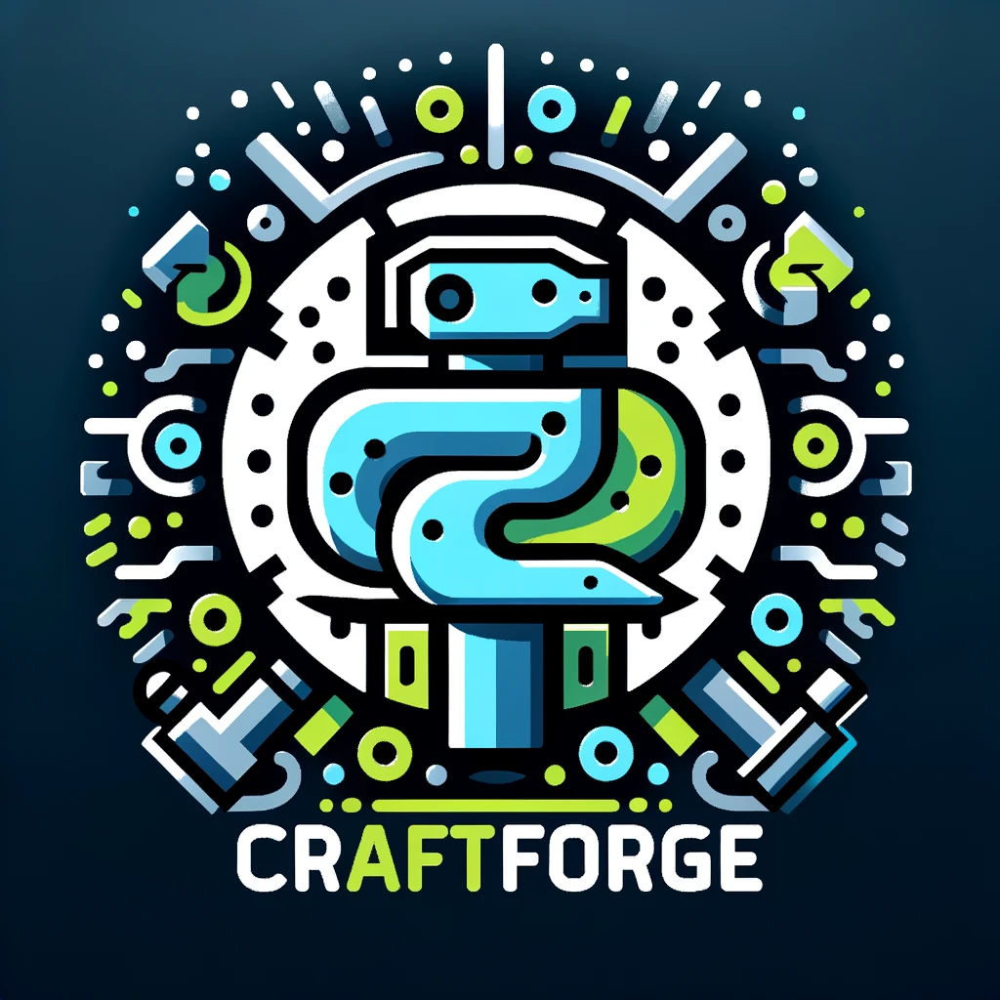

[![Contributors][contributors-shield]][contributors-url]
[![Forks][forks-shield]][forks-url]
[![Stargazers][stars-shield]][stars-url]
[![Issues][issues-shield]][issues-url]
[![MIT License][license-shield]][license-url]

<!-- PROJECT LOGO -->
 

    
  <h3 align="center">CraftForge</h3>
  

    Virtual Operating System for Proof of Concept
     
    <a href="https://github.com/hamatz/chatgpt_minimal_starter_kit/issues">Report Bug</a>
    ·
    <a href="https://github.com/hamatz/chatgpt_minimal_starter_kit/issues">Request Feature</a>
  

<!-- ABOUT THE PROJECT -->
## About The Project

「自社にとって価値があるかどうかも分からないので試しに作ってみよう」という位置付けにあるPoCといえど、要件定義や費用対効果の議論、情報利用に関する関係各部との調整や、業務委託先とのスケジュールや費用の調整など周辺議論ばかりが続き、肝心の「さっさと動くものを使ってアイデアを試したい」という段階までなかなか辿り着けない、というケースが少なくないと思います

そんな方々が、モバイルルーターとマシン１台で気軽にPoCを実践できるような、雛形となる仕組みが作れたら、多くのチームにとって有用なのではないか？という狙いで本プロジェクトを公開しております

Points:
* IT部門等と調整して、ネットワーク上にサーバーをデプロイする必要がありません
* プラグイン機構を備えることで、zip形式で新しいアプリケーションを追加できます
* ユーザ側でプロンプトだけを修正してちょっと試す、といったことが開発者に手間をかけずとも実施可能です
* Fletをベースに構築しているので、プラグインの開発はPythonを利用することが可能です
* UIコンポーネント機構が用意されており、プラグイン側でもそれが利用可能なのでUI構築の手間が削減可能です（UIコンポーネントの網羅性を上げるのはこれから）
* API Layerにアクセストークンを利用するようなクラスを隠蔽する設計となっており、プラグイン開発者は相手のアクセストークン等を意識したコードを書く必要がありません（実装中）

本プロジェクトはまだ出来立ての初期ステージであり、自由にご活用いただくにはもう少しお時間が必要となっておりますので、しばらくお待ちいただけますと幸いです

Use the `BLANK_README.md` to get started.

(<a href="#readme-top">back to top</a>)

### Built With

Flet : https://flet.dev/

<!-- MARKDOWN LINKS & IMAGES -->
<!-- https://www.markdownguide.org/basic-syntax/#reference-style-links -->
[contributors-shield]: https://img.shields.io/github/contributors/hamatz/chatgpt_minimal_starter_kit.svg?style=for-the-badge
[contributors-url]: https://github.com/hamatz/chatgpt_minimal_starter_kit/graphs/contributors
[forks-shield]: https://img.shields.io/github/forks/hamatz/chatgpt_minimal_starter_kit.svg?style=for-the-badge
[forks-url]: https://github.com/hamatz/chatgpt_minimal_starter_kit/network/members
[stars-shield]: https://img.shields.io/github/stars/hamatz/chatgpt_minimal_starter_kit.svg?style=for-the-badge
[stars-url]: https://github.com/hamatz/chatgpt_minimal_starter_kit/stargazers
[issues-shield]: https://img.shields.io/github/issues/hamatz/chatgpt_minimal_starter_kit.svg?style=for-the-badge
[issues-url]: https://github.com/hamatz/chatgpt_minimal_starter_kit/issues
[license-shield]: https://img.shields.io/github/license/hamatz/chatgpt_minimal_starter_kit.svg?style=for-the-badge
[license-url]: https://github.com/hamatz/chatgpt_minimal_starter_kit/blob/master/LICENSE.txt