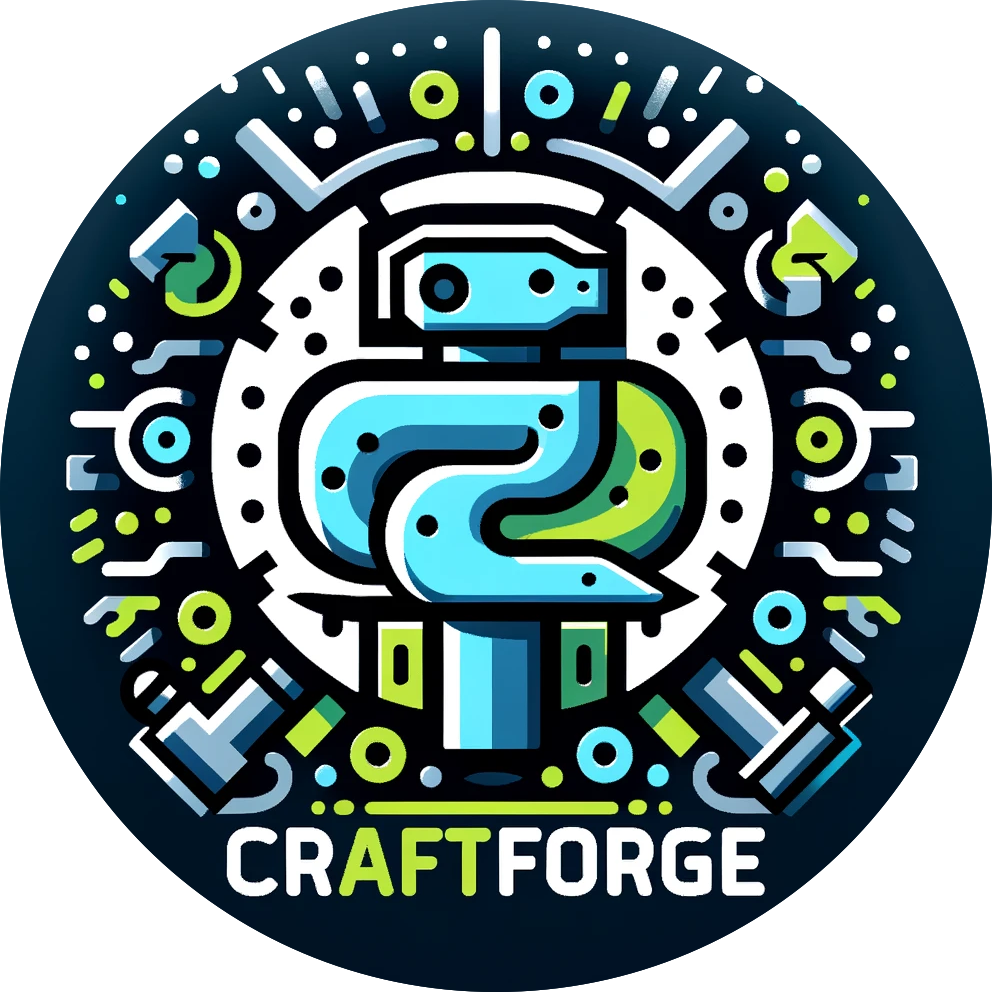

<a name="readme-top"></a>

[![Contributors][contributors-shield]][contributors-url]
[![Forks][forks-shield]][forks-url]
[![Stargazers][stars-shield]][stars-url]
[![Issues][issues-shield]][issues-url]
[![MIT License][license-shield]][license-url]

<!-- PROJECT LOGO -->
<br />
<div align="center">
    
  <h3 align="center">CraftForge</h3>
  <p align="center">
    Yet Another Application Framework Layer for Proof of Concept
    <br />
    <a href="https://github.com/hamatz/chatgpt_minimal_starter_kit/issues">Report Bug</a>
    ·
    <a href="https://github.com/hamatz/chatgpt_minimal_starter_kit/issues">Request Feature</a>
  </p>
</div>

<!-- ABOUT THE PROJECT -->
## About The Project : 
[![CraftForge Screen Shot][product-screenshot]](https://github.com/hamatz/chatgpt_minimal_starter_kit)

### CraftForge: The Magical Toolbox Accelerating the Revolution of Development 
#### ～An Innovative Framework Accelerating Innovation Beyond Corporate Constraints～

### Introduction
In the fast-paced world of modern software development, innovation is the lifeblood of success. However, many companies find their ability to innovate constrained by their environment. To stay ahead in this competitive landscape, tools that break free from these constraints are essential. Enter `CraftForge`, a game-changing application framework designed to accelerate innovation.

## Problem Statement 
Developers working in highly regulated corporate environments often struggle to experiment with new ideas within their limited team. They frequently face stifling conditions such as strict security protocols and unnecessarily lengthy review processes, even for distributing prototypes.

## CraftForge's Solution
`CraftForge` addresses these challenges head-on with its plugin-based architecture. Rather than building monolithic applications, CraftForge empowers developers to create and share small, highly versatile plugins. Configured as simple zip files containing text files, these plugins are easy to install and update without enduring lengthy approval processes. 

At the heart of CraftForge lies `IntentConductor`, a system enabling seamless communication and functionality sharing between plugins. Whether you want to utilize a fantastic UI component from one app or leverage a data processing function from another, IntentConductor makes it possible.

## Internal Structure
Built using the highly readable and gentle learning curve of `Python`, `CraftForge` offers a level of openness and transparency uncommon in enterprise software. Users can actively participate by not only consuming plugins passively but also sharing their own customized plugins. This method of software distribution is key to accelerating innovation.

While installing `Python` on corporate PCs often involves high security barriers, `CraftForge` circumvents this by packaging the Python runtime environment with the application, eliminating the need for separate installations or complex setup procedures.

## Real-World Impact
Since incorporating CraftForge into our workplace operations, we have already begun to witness its benefits. 

Previously, new prototypes could only run on my development machine, leaving other team members no opportunity to interact with them outside of demonstrations. Even simple applications that repeatedly use ChatGPT responses to generate other prompts were inefficient, as team members couldn't edit the prompt templates.

With `CraftForge`, team members can now easily edit prompt templates or even comment out parts of the code, greatly reducing barriers to experimentation. This has dramatically increased the speed of our trial-and-error cycle and alleviated the support burden on developers, allowing us to focus more on adding new features.

Moreover, leveraging `IntentConductor` to create reusable, specialized plugins has significantly accelerated the development speed of `CraftForge` itself. For example, the Dependency Install feature, which allows a plugin to collectively install its dependencies, was developed in just half a day.

CraftForge is a game-changer, enabling the deployment of new ideas in the field and accelerating innovation at unprecedented speeds.  

## Future Plans
Future developments under consideration include:

- Expanding the libraries available for import by plugins
- Establishing servers for sharing plugins within the community 
- Adding multi-language support
- Enhancing AI assistance (supporting plugin development, auto-generating documentation, etc.)
- Integrating with cloud services

While these are our current plans, one thing is certain: CraftForge will continue to evolve.

## Conclusion
`CraftForge` is more than just an application framework. It represents a means to liberate developers from the constraints that have long bound them. Though still in its early stages, we believe CraftForge holds immense potential. If you are interested in joining our efforts to usher in a new era of development freedom, please get in touch!

<p align="right">(<a href="#readme-top">back to top</a>)</p>


### Built With

<a href="https://flet.dev/">

</a>

<p align="right">(<a href="#readme-top">back to top</a>)</p>


<!-- GETTING STARTED -->
## Getting Started

### Prerequisites

  ```sh
  pip install flet
  pip install cryptography
  pip install openai
  pip install langchain
  pip install qdrant_client
  pip install tiktoken
  pip install pypdf2
  pip install pyinstaller
  ```

  or

```sh
pip install requirements.txt
```

### Installation


1. Clone the repo
   ```sh
   git clone https://github.com/hamatz/chatgpt_minimal_starter_kit.git
   ```
2. Run the app with flet
   ```sh
   flet run app.py
   ```

### Build as exe file

1. Build the app
   ```sh
   chmod +x build_on_mac.sh
   ./build_on_mac.sh
   or
   ./build_on_win.ps1
   ```
2. in case you need hidden import 
   ```sh
   pyinstaller app.spec --clean
   ```


### Documents

- [Plugin Developer Manual](https://github.com/hamatz/chatgpt_minimal_starter_kit/blob/main/doc/developer_manual.md)


<p align="right">(<a href="#readme-top">back to top</a>)</p>


## Intended Uses of CraftForge

1. **Accelerating the Internal Innovation Cycle**: CraftForge removes technical barriers and simplifies the process from ideation to implementation. The easy sharing and installation of plugins via zip files enable rapid testing of new features and sharing within the team, significantly speeding up the innovation cycle. This process dramatically simplifies the approach to innovation, lowering the threshold for trying out new ideas within the company.

2. **Education and Training**: Utilize CraftForge in internal education and training programs as a practical learning tool. It can be used for a wide range of applications, from teaching the basics of programming and application development to simulating specific business cases.

3. **Rapid Provision of Customer PoCs**: Use CraftForge to quickly respond to various idea validations through customized services. It enables the rapid development of solutions based on customer requirements, speeding up the idea validation loop, thereby enhancing customer satisfaction and creating differentiation.


<p align="right">(<a href="#readme-top">back to top</a>)</p>


<!-- CONTRIBUTING -->
## Contributing

Contributions are what make the open source community such an amazing place to learn, inspire, and create. Any contributions you make are **greatly appreciated**.

If you have a suggestion that would make this better, please fork the repo and create a pull request. You can also simply open an issue with the tag "enhancement".
Don't forget to give the project a star! Thanks again!

1. Fork the Project
2. Create your Feature Branch (`git checkout -b feature/AmazingFeature`)
3. Commit your Changes (`git commit -m 'Add some AmazingFeature'`)
4. Push to the Branch (`git push origin feature/AmazingFeature`)
5. Open a Pull Request

<p align="right">(<a href="#readme-top">back to top</a>)</p>


<!-- LICENSE -->
## License

Distributed under the MIT License. See `LICENSE.txt` for more information.

<p align="right">(<a href="#readme-top">back to top</a>)</p>

<!-- MARKDOWN LINKS & IMAGES -->
<!-- https://www.markdownguide.org/basic-syntax/#reference-style-links -->
[contributors-shield]: https://img.shields.io/github/contributors/hamatz/chatgpt_minimal_starter_kit.svg?style=for-the-badge
[contributors-url]: https://github.com/hamatz/chatgpt_minimal_starter_kit/graphs/contributors
[forks-shield]: https://img.shields.io/github/forks/hamatz/chatgpt_minimal_starter_kit.svg?style=for-the-badge
[forks-url]: https://github.com/hamatz/chatgpt_minimal_starter_kit/network/members
[stars-shield]: https://img.shields.io/github/stars/hamatz/chatgpt_minimal_starter_kit.svg?style=for-the-badge
[stars-url]: https://github.com/hamatz/chatgpt_minimal_starter_kit/stargazers
[issues-shield]: https://img.shields.io/github/issues/hamatz/chatgpt_minimal_starter_kit.svg?style=for-the-badge
[issues-url]: https://github.com/hamatz/chatgpt_minimal_starter_kit/issues
[license-shield]: https://img.shields.io/github/license/hamatz/chatgpt_minimal_starter_kit.svg?style=for-the-badge
[license-url]: https://github.com/hamatz/chatgpt_minimal_starter_kit/blob/master/LICENSE.txt
[product-screenshot]: doc/img/demo.gif
