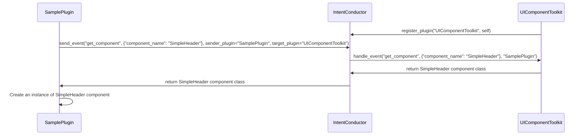
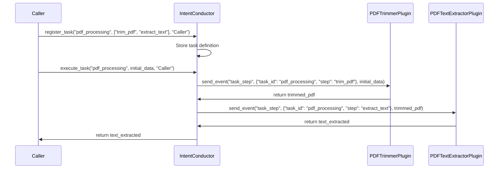

# CraftForge プラグイン開発マニュアル

## 1. はじめに

### 1.1 CraftForgeの概要
CraftForgeは、Fletをベースとしたアプリケーションフレームワークであり、PyInstallerを使用して実行可能ファイル（exe）として配布されるような運用を想定しています。ユーザーは、Pythonランタイム環境でプラグインを追加することができます。CraftForgeは、UIコンポーネントやAPIを提供し、開発者はこれらを利用してプラグインを開発します。

### 1.2 プラグインアーキテクチャの説明
CraftForgeのプラグインは、以下の要素で構成されています。

- プラグインのメインモジュール（Pythonファイル）
- 定義ファイル（plugin.json）
- アイコン画像ファイル

プラグインは、`PluginInterface`を実装したPythonクラスとして作成されます。システムプラグインは、`SystemPluginInterface`を実装し、特権APIにアクセスすることができます

どちらもシングルトンで実装されることを想定しています。従いまして、以下のような宣言から始まることになります。

```python
class SamplePlugin(PluginInterface):

    _instance = None
    
    def __new__(cls, intent_conducto):
        if cls._instance is None:
            cls._instance = super(SamplePlugin, cls).__new__(cls)
            # 新しいインスタンスの初期化
            cls._instance.intent_conducto = intent_conducto
        return cls._instance
```

プラグインは、ZIP形式でパッケージ化され、CraftForgeにインストールされます。インストールされたプラグインは、CraftForgeのホーム画面に表示され、ユーザーはプラグインを選択して起動することができます。

ただし、システムプラグインにはインストール用のUIは用意されておらず、CraftForgeの実行ファイルが配置されているのと同じディレクトリに置かれた`system`ディレクトリの配下に置かれた場合にのみ、特権APIを利用可能となり、UI操作では削除不可能のシステムプラグインとして扱われるようになります。

## 2. 開発環境のセットアップ

### 2.1 必要な開発ツールとライブラリ
CraftForgeプラグインの開発には、以下のツールとライブラリが必要です。

- Python 3.7以上（オリジナル開発環境としては 3.11.6 を利用しています）
- CraftForgeが提供するライブラリ（Flet、その他のインポート済みライブラリ）

プラグイン開発者は、Python標準ライブラリとCraftForgeが提供するライブラリのみを使用して開発する必要があります。exeファイル内に抱え込まれているもの以外のライブラリをインポートすることはできません。（少なくとも exeファイルを利用しているユーザーの環境では動作しません）

### 2.2 サンプルプラグインのセットアップ
サンプルプラグインをベースに開発を始めることをお勧めします。サンプルプラグインは、CraftForgeリポジトリの`plugin_sample`ディレクトリにあります。このディレクトリにあるファイルをコピーするなどして、新しいプラグインの開発を始めてください。

## 3. プラグインの構造

### 3.1 プラグインのディレクトリ構造
プラグインのディレクトリ構造は以下のようになります。

```
my_plugin/
├── plugin.json
├── icon.png
└── my_plugin.py
```

- `plugin.json`: プラグインの定義ファイル
- `icon.png`: プラグインのアイコン画像
- `my_plugin.py`: プラグインのメインモジュール

### 3.2 必要なファイルの説明
#### 3.2.1 定義ファイル（plugin.json）
`plugin.json`は、プラグインのメタデータを定義するファイルです。以下のような情報を含みます。

```json
{
    "name": "My Plugin",
    "version": "1.0.0",
    "description": "A sample plugin for CraftForge",
    "main_module": "my_plugin",
    "plugin_name": "MyPlugin",
    "icon": "icon.png"
}
```

- `name`: プラグインの名前
- `version`: プラグインのバージョン
- `description`: プラグインの説明
- `main_module`: プラグインのメインモジュールのファイル名（拡張子を除く）
- `plugin_name`: プラグインのクラス名
- `icon`: プラグインのアイコン画像のファイル名

#### 3.2.2 アイコン画像
`icon.png`は、プラグインのアイコン画像です。この画像は、CraftForgeのホーム画面でプラグインを表示するために使用されます。推奨サイズは、360x360ピクセル以上です。

## 4. プラグインの開発

### 4.1 プラグインのライフサイクル
CraftForgeでは、プラグインのライフサイクルを管理するために、`PluginManager`クラスが使用されます。その際の処理の流れは以下のようになっています。

1. プラグインのインストール
   - ユーザーがCraftForgeのホーム画面上にある「Install Plugin」をクリックすると表示されるファイル選択用ダイアログ上でプラグインのZIPファイルを選択すると、`PluginManager`はプラグインを解凍し、必要なファイルを読み込みます。

2. プラグインの読み込み
   - `PluginManager`は、プラグインの定義ファイル（`plugin.json`）を読み込み、プラグインのメタデータを取得します。
   - プラグインのメインモジュールがインポートされ、プラグインクラスがインスタンス化されます。

3. プラグインの表示
   - `PluginManager`は、プラグインのアイコン画像を読み込み、CraftForgeのホーム画面にプラグインのアイコンを表示します。
   - プラグインのアイコンには、クリックイベントが割り当てられ、クリックされるとプラグインの`load`メソッドが呼び出されるようスタンバイされます。

4. プラグインの実行
   - ユーザーがプラグインのアイコンをクリックすると、`PluginManager`はプラグインの`load`メソッドを呼び出します。
   - `load`メソッドには、`page`（Fletの`Page`オブジェクト）、`function_to_top_page`（ホーム画面に戻るための関数）、`my_app_path`（プラグインのディレクトリパス）、`api`（CraftForgeのAPIオブジェクト）が渡されます。
   - プラグインは、`load`メソッド内で必要なUIコンポーネントを作成し、一度画面をクリアした後でページに自分自身を表示します。

5. プラグインの終了
   - ユーザーがプラグインを終了すると、`function_to_top_page`関数が呼び出され、CraftForgeのホーム画面に戻ります。
   - その際プラグインは、必要に応じてリソースの解放やクリーンアップ処理を行います。

以下は、`PluginManager`クラスの`_load_plugin`メソッドの一部です。このメソッドは、プラグインの読み込みと表示を担当します。

```python
def _load_plugin(self, plugin_dir: str, container: ft.Container):
    # ...
    clickable_image = ft.GestureDetector(
        content=app_icon,
        on_tap=lambda _, instance=plugin_instance, extract_dir=plugin_dir: instance.load(self.page, self.page_back_func, extract_dir, self.api)
    )
    # ...
```

上記のコードでは、プラグインのアイコン画像に`GestureDetector`が割り当てられ、`on_tap`イベントに`plugin_instance.load`メソッドが登録されています。これにより、ユーザーがプラグインのアイコンをクリックすると、対応するプラグインの`load`メソッドが呼び出されることにより起動する仕組みとなっています。

### 4.2 プラグインの開発手順
プラグインを開発する際は、以下の手順に従ってください。

1. プラグインのディレクトリを作成します。
2. `plugin.json`ファイルを作成し、プラグインのメタデータを定義します。
3. プラグインのアイコン画像を用意し、`icon.png`という名前で保存します（メタデータ側を修正することで別の名前を使うことも可能です）。
4. プラグインのメインモジュールを作成し、`PluginInterface`を実装します。
5. `__init__`メソッドでIntentConductorを受け取り、必要な初期化処理を行います。
6. `load`メソッドを実装し、プラグインのUIを構築します。
   - `page`オブジェクトを使用してUIコンポーネントを作成し、ページに追加します。
   - `function_to_top_page`関数を使用して、ホーム画面に戻るボタンやアクションを実装します。
   - `my_app_path`を使用して、プラグインのリソースファイルのパスを取得します。
   - `api`オブジェクトを使用して、CraftForgeの機能を呼び出します。
7. プラグインをテストし、正常に動作することを確認します。
8. プラグインをZIPファイルにパッケージ化します。

以下は、プラグインの`load`メソッドの例です。

```python
    def load(self, page: ft.Page, function_to_top_page, my_app_path: str, api):

        # UIComponentToolkit からUIコンポーネントを取得する
        def get_component(component_name, **kwargs):
            api.logger.info(f"Requesting component: {component_name}")
            target_component = {"component_name": component_name}
            response = self.intent_conductor.send_event("get_component", target_component, sender_plugin=self.__class__.__name__, target_plugin="UIComponentToolkit")
            if response:
                component_class = response
                api.logger.info(f"Received component: {component_name}")
                return component_class(**kwargs)
            else:
                api.logger.error(f"component cannot be found: {component_name}")

        my_header_widget = get_component("SimpleHeader", icon=ft.icons.TABLE_RESTAURANT, title_text="Sample Plugin v.0.1.0", color="#20b2aa")

        greeting_text = ft.Text("はじめてのプラグインです", size=20)
        #ホーム画面に戻るボタンの作成
        back_button = ft.ElevatedButton("Back to Main Page", on_click=lambda _: function_to_top_page())

        page.clean() #描画前のクリーンアップ
        page.add(my_header_widget)
        page.add(greeting_text, back_button)
        page.update()
```

上記の例では、`load`メソッド内でヘッダー、テキスト、ホーム画面に戻るボタンを作成し、ページに追加しています。`function_to_top_page`関数を使用して、ホーム画面に戻るボタンのクリックイベントを処理しています。

プラグインを開発する際は、このような構造に従って、必要なUIコンポーネントを作成し、イベントハンドリングを行ってください。`api`オブジェクトを使用して、CraftForgeの機能を呼び出すこともできます。

プラグインの開発が完了したら、プラグインをZIPファイルにパッケージ化し、CraftForgeにインストールして動作を確認してください。

これらの情報を踏まえて、プラグインの開発を進めてください。不明な点や問題がある場合は、公式ドキュメントやコミュニティフォーラムを参照するか、CraftForgeの開発チームにお問い合わせください。

### 4.3 APIを利用したプラグイン開発について

CraftForgeでは、プラグイン開発者がセンシティブな情報を直接扱わなくても済むように、APIを通じて各種機能を提供しています。特に、外部サービスとの連携が必要な場合、APIを介することで、トークンやデプロイメント情報などの機密情報をプラグイン内で持つ必要がなくなります。

以下は、`SampleChat`プラグインの一部を抜粋したコードです。このプラグインでは、OpenAIとAzure OpenAIのAPIを利用してチャットアプリを作成しています。

```python
class SampleChat(PluginInterface):
    def load(self, page: ft.Page, function_to_top_page, my_app_path: str, api):
        # ...

        def set_gpt_client() -> None:
            if self.my_service == "OpenAI":
                self.chat_client = api.get_chat_gpt_instance()
                self.my_gpt_model = api.get_openai_gpt_model_name()
            elif self.my_service == "Azure":
                self.chat_client = api.get_azure_gpt_instance()
                self.my_azure_deployment_name = api.get_my_azure_deployment_name()

        # ...
```

上記のコードでは、`api`オブジェクトを使用して、OpenAIとAzure OpenAIのインスタンスを取得しています。`api.ai.get_chat_gpt_instance()`メソッドは、OpenAIのインスタンスを返し、`api.ai.get_azure_gpt_instance()`メソッドは、Azure OpenAIのインスタンスを返します。これらのメソッドは、内部でトークンやデプロイメント情報を解決し、認証済みのインスタンスを返します。

プラグイン開発者は、これらのメソッドを呼び出すだけで、セキュアにAPIを利用することができます。トークンやデプロイメント名などの機密情報は、CraftForgeのシステム設定で一元管理されており、それらのデータに対して直接プラグインがアクセスすることはできません。

以下は、`api`オブジェクトが提供するメソッドの一部です。

- `ai.get_chat_gpt_instance()`: OpenAIのインスタンスを取得します。
- `ai.get_openai_gpt_model_name()`: OpenAIで使用するGPTモデルの名前を取得します。
- `ai.get_azure_gpt_instance()`: Azure OpenAIのインスタンスを取得します。
- `ai.get_my_azure_deployment_name()`: Azure OpenAIで使用するデプロイメント名を取得します。

これらのメソッドを使用することで、プラグイン開発者は機密情報を意識することなく、安全にAPIを利用できます。

また、`api`オブジェクトは、他にも以下のような機能を提供しています。

- ファイルの読み込み（`files.get_pdf_reader()`など）
- プラグイン自身が管理するデータの暗号化と復号化（`content_key.save()`、`content_key.load()`など）
- ベクトルデータベースの利用（`ai.load_qdrant_for_azure()`など）

これらの機能を活用することで、プラグイン開発者はより高度なアプリケーションを開発することができます。

APIを利用したプラグイン開発には、以下のようなメリットがあります。

1. 機密情報を直接扱う必要がなく、プラグイン配布時におけるセキュリティリスクを軽減できる。
2. CraftForgeのシステム設定で一元管理された情報を利用できるため、設定の変更がプラグインに即時反映される。
3. 複雑な認証処理やエラーハンドリングを個別に実装する必要がなく、開発の手間が削減できる。
4. 他のプラグインが保存に利用しているデータフォルダのパスを取得する（ただし共有フォルダ管理プラグインによる事前の設定が必要）など、通常の実装だけでは実現できないことができる

APIを活用することで、プラグイン開発者はセキュアかつ効率的にアプリケーションを開発できます。

### 4.4 IntentConductorを利用したプラグイン開発について

CraftForgeではシステム上にインストールされている異なったプラグインに対し処理を依頼するための機構として`IntentConductor`が提供されています。プラグインの初期化時に`PluginManager`からパラメータとして受け取った`IntentConductor`に対して自分自身を登録する事により、そこに登録されている他のプラグインに対してメッセージを送信することができるようになっています。この際、受取先となるプラグインを指定することも、登録されている全てのプラグインに送信することも、どちらも可能となっています。

#### 機能の呼び出し　：プラグイン同士の連携

具体的にイメージしやすいよう、流れをシーケンス図で示します。



以下は、シーケンス図に対応する IntentConductor の実装です。

```python
class IntentConductor:
    def __init__(self, api):
        self.plugins = {}
        self.api = api

    def register_plugin(self, plugin_name, plugin):
        self.plugins[plugin_name] = plugin
        if hasattr(plugin, 'handle_event'):
            self.plugins[plugin_name].handle_event = plugin.handle_event.__get__(plugin)

    def unregister_plugin(self, plugin_name):
        del self.plugins[plugin_name]

    def send_event(self, event_name, data, sender_plugin, target_plugin=None):
        self.api.logger.info(f"Sending event: {event_name}, Data: {data}, Sender: {sender_plugin}, Target: {target_plugin}")
        if target_plugin:
            plugin = self.plugins.get(target_plugin)
            # 受け取り先プラグイン指定でのイベント送信はレスポンスを期待して呼び出されていると考えて結果をreurnする
            if plugin:
                return plugin.handle_event(event_name, data, sender_plugin)
        else:
            for plugin_name, plugin in self.plugins.items():
                if plugin_name != sender_plugin:
                    plugin.handle_event(event_name, data, sender_plugin)
            # ブロードキャストの場合はUIコンポーネントのテーマ変更など、受け取り側で処理をするだけでリプライ不要のメッセージと考えて処理終了後にただ"Finished"を返す
            return "Finished"
        
    def register_task(self, task_id, task_definition, owner_plugin_path):
        self.tasks[task_id] = task_definition
        self.task_owners[task_id] = owner_plugin_path

    def execute_task(self, task_id, initial_data, caller_plugin_path):
        if task_id in self.tasks and self.task_owners[task_id] == caller_plugin_path:
            task_definition = self.tasks[task_id]
            self.send_event("task_start", {"task_id": task_id, "data": initial_data})
            for step in task_definition:
                self.send_event("task_step", {"task_id": task_id, "step": step})
            self.send_event("task_end", {"task_id": task_id})
        else:
            self.api.logger.warning(f"Warning: Unauthorized task execution attempt. Task ID: {task_id}, Caller: {caller_plugin_path}")
```

#### シーケンス図の説明:

1. UIComponentToolkitは、起動時にIntentConductorの`register_plugin`メソッドを呼び出し、自身を"UIComponentToolkit"という名前でIntentConductorに登録します。

```python
def __new__(cls, system_api : SystemAPI, intent_conductor: IntentConductor):
    if cls._instance is None:
        cls._instance = super(UIComponentToolkit, cls).__new__(cls)
        cls._instance.system_api = system_api
        cls._instance.intent_conductor = intent_conductor
        cls._instance.component_dir = "system/ui_components/components"
        cls._instance.components = {}
        cls._instance.load_components()
        cls._instance.intent_conductor.register_plugin("UIComponentToolkit", cls._instance)
    return cls._instance
```

2. SamplePluginは、IntentConductorに対して`get_component`イベントを送信します。イベントのデータには、要求するコンポーネント名（`SimpleHeader`）が含まれます。送信元プラグインと受信先プラグインも指定されます。

```python
def get_component(component_name, **kwargs):
    api.logger.info(f"Requesting component: {component_name}")
    target_component = {"component_name": component_name}
    response = self.intent_conductor.send_event("get_component", target_component, sender_plugin=self.__class__.__name__, target_plugin="UIComponentToolkit")
```

3. IntentConductorは、`get_component`イベントをUIComponentToolkitの `handle_event`を呼び出す形で転送します。

```python
    def send_event(self, event_name, data, sender_plugin, target_plugin=None):
        self.api.logger.info(f"Sending event: {event_name}, Data: {data}, Sender: {sender_plugin}, Target: {target_plugin}")
        if target_plugin:
            plugin = self.plugins.get(target_plugin)
            # 受け取り先プラグイン指定でのイベント送信はレスポンスを期待して呼び出されていると考えて結果をreurnする
            if plugin:
                return plugin.handle_event(event_name, data, sender_plugin)
```

4. UIComponentToolkitは、要求されたコンポーネント名に対応するコンポーネントクラス（`SimpleHeader`）を返します。

```python
def handle_event(self, event_name, data, sender_plugin):
    if event_name == "get_component":
        component_name = data["component_name"]
        component_class = self.get_component(component_name)
        return component_class
```

5. IntentConductorは、UIComponentToolkitから受け取ったコンポーネントクラスをSamplePluginに返します。

```python
return plugin.handle_event(event_name, data, sender_plugin)
```

6. SamplePluginは、受け取ったコンポーネントクラスのインスタンスを作成します。

```python
    if response:
        component_class = response
        api.logger.info(f"Received component: {component_name}")
        return component_class(**kwargs)
    else:
        api.logger.error(f"component cannot be found: {component_name}")
```

このように、`IntentConductor`は、プラグイン間のイベントの送受信を仲介する役割を果たしています。これにより、プラグインは互いに直接通信することなく、`IntentConductor`を介して連携することができます。

#### Pipe：プラグインの処理結果をつなぎ合わせる形で作業を自動化する

Pipe機能は、複数のプラグインの処理を連携させ、ルーティーン作業を自動化するために使用されます。

以下は、PDFの指定ページ以降を削除するプラグイン（PDFTrimmerPlugin）とPDFからテキストを抽出してベクトルDBに登録するプラグイン（PDFTextExtractorPlugin）を連携させる例です。



シーケンス図の説明:

1. 呼び出し元（Caller）は、IntentConductorの`register_task`メソッドを使用して、"pdf_processing"というタスクを登録します。タスクの定義には、実行するステップ（"trim_pdf"と"extract_text"）と所有者プラグイン（"Caller"）が含まれています。
2. IntentConductorは、タスクの定義を内部に保存します。
3. 呼び出し元は、`execute_task`メソッドを使用して、"pdf_processing"タスクを実行します。初期データ（`initial_data`）を渡します。
4. IntentConductorは、タスクの最初のステップ（"trim_pdf"）を実行するために、PDFTrimmerPluginに`task_step`イベントを送信します。
5. PDFTrimmerPluginは、PDFを指定ページでトリミングし、トリミングされたPDF（`trimmed_pdf`）をIntentConductorに返します。
6. IntentConductorは、タスクの次のステップ（"extract_text"）を実行するために、PDFTextExtractorPluginに`task_step`イベントを送信します。トリミングされたPDFを渡します。
7. PDFTextExtractorPluginは、トリミングされたPDFからテキストを抽出し、抽出されたテキスト（`text_extracted`）をIntentConductorに返します。
8.  IntentConductorは、抽出されたテキストを呼び出し元に返します。

ここまでだとあまり嬉しさが伝わらないかもしれません。

IntentConductorのPipe機能を使用することで、従来は手作業で繰り返し行っていた一連の処理を自動化することができます。例えば特定のフォルダ内にある複数のPDFファイルを一括で処理し、トリミングとテキスト抽出、ベクトルDBへの登録を自動で行う応用などは、まさにPipe機能の活用シーンとして適切です。

以下は、そのような一括処理を行うプラグインの例です。

```python
import os

class PDFBatchProcessorPlugin(PluginInterface):
    def __init__(self, intent_conductor):
        super().__init__(intent_conductor)

    def process_pdfs_in_folder(self, folder_path):
        pdf_files = [f for f in os.listdir(folder_path) if f.endswith(".pdf")]
        
        for pdf_file in pdf_files:
            pdf_file_path = os.path.join(folder_path, pdf_file)
            initial_data = {
                "pdf_file_path": pdf_file_path,
                "trim_from_page": 5
            }
            result = self.intent_conductor.execute_task("pdf_processing", initial_data, self.__class__.__name__)
            
            extracted_text = result["extracted_text"]
            self.register_to_vector_db(extracted_text)

    def register_to_vector_db(self, text):
        # ベクトルDBへの登録処理を実装
        pass
```

このプラグインでは、`process_pdfs_in_folder`メソッドが指定されたフォルダ内のPDFファイルを一括で処理します。以下の手順で処理が行われます。

1. 指定されたフォルダ内のPDFファイルのリストを取得します。
2. 各PDFファイルに対して以下の処理を行います。
   - PDFファイルのパスと、トリミングを開始するページ数を初期データとして準備します。
   - `execute_task`メソッドを呼び出し、"pdf_processing"タスクを実行します。このタスクは、PDFのトリミングとテキスト抽出を行います。
   - タスクの実行結果から、抽出されたテキストを取得します。
   - 抽出されたテキストをベクトルDBに登録します（`register_to_vector_db`メソッド）。

このプラグインを使用することで、ユーザーは単一のメソッド呼び出しで、フォルダ内の全てのPDFファイルに対して、トリミング、テキスト抽出、ベクトルDBへの登録を自動で行うことができます。

```python
pdf_batch_processor = PDFBatchProcessorPlugin(intent_conductor)
pdf_batch_processor.process_pdfs_in_folder("path/to/pdf/folder")
```

このように、IntentConductorのPipe機能を活用することで、複雑な一連の処理を自動化し、ユーザーの手作業を大幅に削減することができます。これは、大量のPDFファイルを処理する必要があるユースケースや、定期的に同じ処理を繰り返す必要があるシナリオで特に有用です。

プラグイン開発者は、このような一括処理の機能を提供することで、ユーザーに大きな価値を提供することができます。そして、すべての処理を自分で書くよりも、遥かに手軽で手早く完成させることができるのです。

## 5. プラグインのパッケージング

### 5.1 プラグインのZIPファイル化
プラグインをCraftForgeにインストールするには、プラグインのファイルをZIPアーカイブ化する必要があります。以下のコマンドを使用して、プラグインをZIPファイル化します。

```bash
cd my_plugin
zip -r my_plugin.zip *
```

上記のコマンドを実行すると、`my_plugin.zip`ファイルが作成されます。

### 5.2 プラグインのインストール方法
作成したZIPファイルを、CraftForgeのホーム画面上にある`install plugin`のボタンをクリックすることで表示されるファイル選択ダイアログから指定することで、プラグインをインストールできます。インストールが完了すると、プラグインがホーム画面に表示されます。

### 5.3 プラグインのバージョン管理
CraftForgeでは、プラグインのバージョン管理が行われます。新しいバージョンのプラグインをインストールする際、ユーザーが明示的に古いバージョンを削除しない限り、新しいバージョンは別のプラグインとしてインストールされます。そのためホーム画面上で区別がつくようバージョン番号も表示する実装となっています。この仕様により、ユーザーが編集したプラグインが誤って上書きされることを予防しています。ただし古いプラグインも無条件に上書きされて消えることがない、というだけで新旧でクラス名が同じプラグインが混在して利用可能となるわけではありません。ユーザー側で`installed_plugins`ディレクトリ下にあるプラグインのソースコードを編集し、どちらかのプラグインのクラス名の末尾に数字をつけるなどしてCraftForge上で別のものとして認識できる状態にする必要があります点、ご注意ください。

## 6. デバッグとトラブルシューティング

### 6.1 デバッグ方法
プラグインのデバッグは、Pythonの標準的なデバッグ手法を使用して行います。`print`文を使用してログを出力したり、デバッガを使用してブレークポイントを設定したりできます。

ただし、exeファイルの形態では`print`文を利用したデバッグができないため、CraftForgeの設定プラグインを利用することにより、デバッグフラグのON/OFFを切り替えることができるようになっています。このデバッグフラグがONとなっている場合は、デバッグ情報がログファイルに出力可能な状態となります。

`api.logger` では

- debug
- info
- warning
- error

の４種別でのログメッセージが出力可能となっています。たとえばエラーログとして出力したい場合は以下のような形で利用します。
```python
api.logger.error(f"Error loading or encoding icon: {e}")
```
ログの情報は、CraftForgeが置かれているのと同じ階層に`CraftForge.log`として追記されていく形で保存されます。

### 6.2 よくあるエラーとその対処法
- `ImportError`: 許可されていないモジュールをインポートしようとした場合に発生します。Python標準ライブラリとCraftForgeが提供するライブラリのみを使用してください。
- `AttributeError`: プラグインクラスにメソッドが実装されていない場合に発生します。`PluginInterface`で定義されているメソッドを実装してください。
- `FileNotFoundError`: 必要なファイルが見つからない場合に発生します。プラグインのディレクトリ構造が正しいことを確認してください。

## 7. サンプルプラグインの解説

### 7.1 基本的なサンプルプラグインの解説
`plugins_sample`ディレクトリには、基本的なサンプルプラグインがいくつか含まれています。これらを参考に、独自のプラグインを開発してください。`Hello World`的な最も基本的な形態は`test_app_new1`フォルダに格納されています。また、`test_app_new2`フォルダには、Fletのチュートリアル等で紹介されている計算機アプリを移植したものが格納されています。ほぼ同じものが利用可能であることがお分かりいただけると思います。

### 7.2 APIを利用したサンプルプラグインの解説
`plugins_sample/sample_chat`ディレクトリには、APIを利用したサンプルプラグインが含まれています。このプラグインは、`API`を使用して外部サービスと連携します。APIを利用する際の参考にしてください。

## 8. プラグイン開発のベストプラクティス

### 8.1 コードの構造化
プラグインのコードは、可読性と保守性を高めるために、適切に構造化する必要があります。関連する機能をグループ化し、明確な責務を持つ関数やクラスに分割してください。

### 8.2 エラーハンドリング
プラグインでは、適切なエラーハンドリングを行うことが重要です。例外が発生した場合は、適切なエラーメッセージを表示し、必要に応じてログを出力してください。

### 8.3 パフォーマンスの最適化
プラグインのパフォーマンスを最適化するために、以下の点に注意してください。

- 不要な処理を避ける
- 大量のデータを扱う場合は、ジェネレータやストリーミングを使用する
- 重い処理は、バックグラウンドスレッドで実行する

## 9. よくある質問（FAQ）
- Q: プラグインの開発にはどのようなスキルが必要ですか？ 
  A: Pythonの基本的な知識と、Fletを使用したUIの開発経験が必要です。 

- Q: プラグインをアップデートするにはどうすればよいですか？ 
  A: プラグインのバージョンを上げて、再度ZIPファイル化してインストールしてください。古いバージョンのプラグインは自動的に別のプラグインとして扱われます。 

- Q: プラグインのアイコン画像の形式は何ですか？ 
  A: PNGまたはJPEG形式の画像を使用してください。 

## 10. 参考リソース

### 10.1 公式ドキュメント
- [CraftForge公式リポジトリ](https://github.com/hamatz/chatgpt_minimal_starter_kit)
- [Flet公式ドキュメント](https://flet.dev/docs/)


