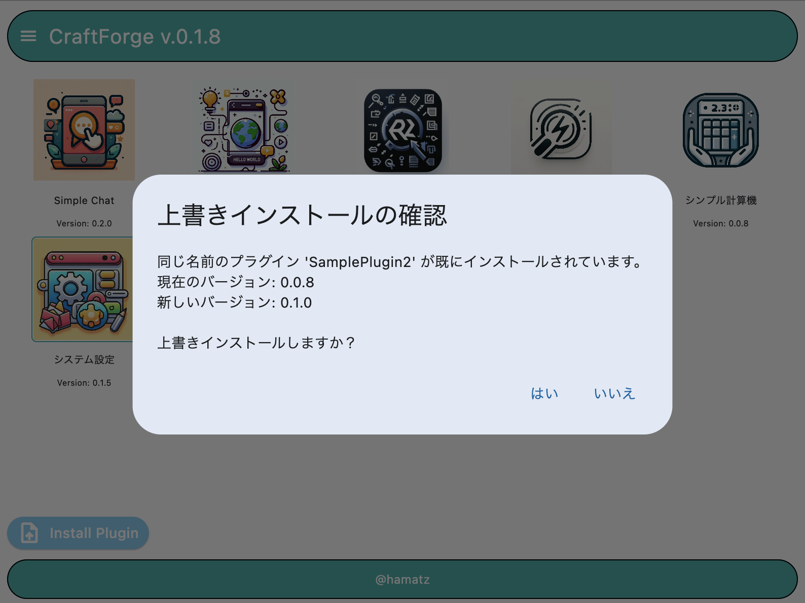
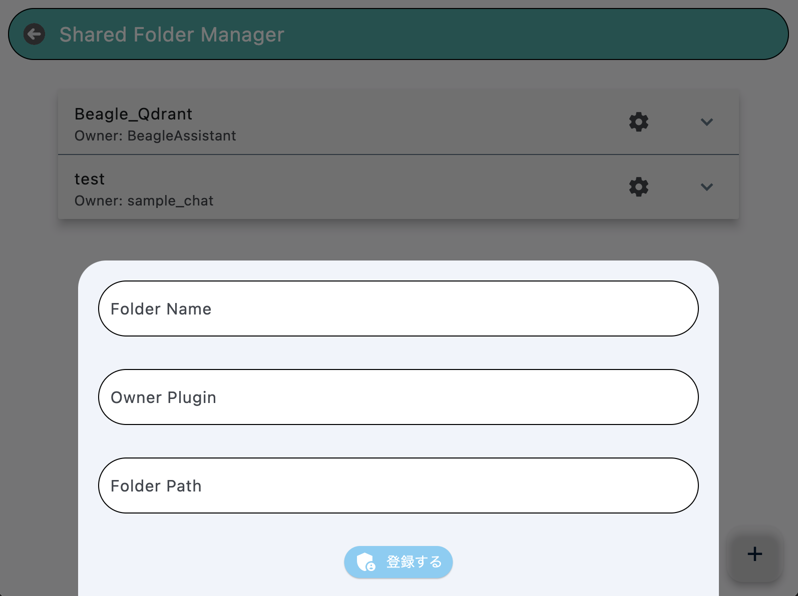
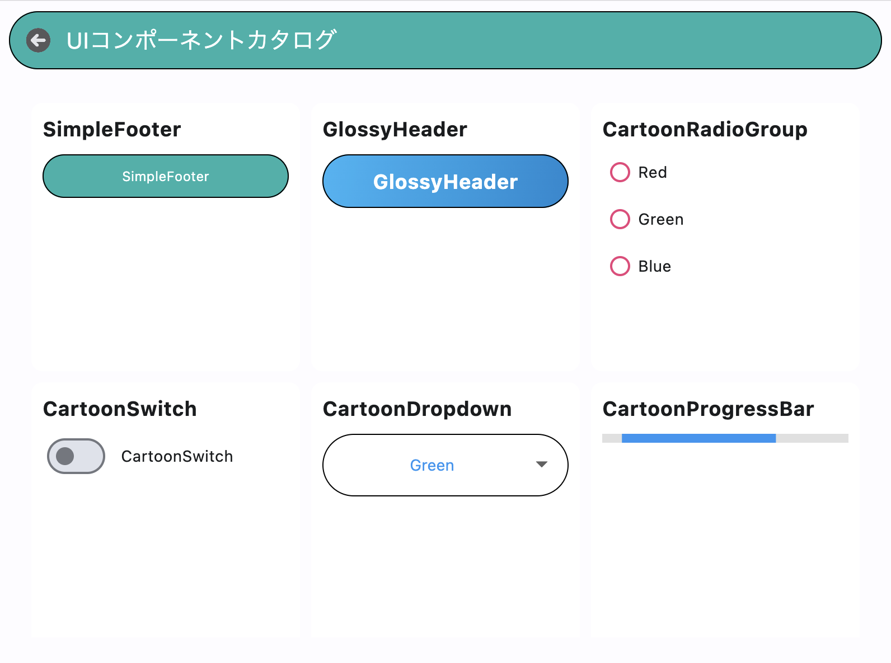

# 1. はじめに

    

   
## 1.1. CraftForgeの概要
   
CraftForgeは、Pythonプログラミング言語とFletウェブフレームワークを基盤とした、革新的なデスクトップアプリケーションプラットフォームです。CraftForgeの目的は、誰もが簡単にアプリケーションを開発、共有、カスタマイズできる環境を提供することです。

CraftForgeは、プラグインアーキテクチャを採用しています。プラグインは、zipファイルとして配布され、ユーザーはそれをCraftForgeにインストールすることで新しい機能を追加できます。プラグインは、Pythonで書かれており、ソースコードが公開されているため、ユーザーはプラグインの動作を理解し、必要に応じて修正や拡張を行うことができます。

## 1.2. CraftForgeの特徴

- Pythonベース: 広く使われているプログラミング言語であるPythonを採用し、学習やカスタマイズが容易。
- プラグインアーキテクチャ: 新しい機能をzipファイルとして追加可能で、インストールが簡単。
- オープンソース: ソースコードが公開されており、企業毎に独自のカスタマイズも可能。
- 迅速なアプリケーション開発: アイデアを素早く形にできる環境を提供。
- コラボレーションの促進: プラグインの共有を通じて、コラボレーションとコミュニティを育成。
- セキュアなプラグイン開発: APIレイヤーが機密情報を保護し、安全なプラグイン開発が可能。
- 業務用PCをClientとして利用するシンプルなシステム構成による開発・運用コストの低減。`社内にある有用なデータを業務用PCの中に閉じて利用可能`

## 1.3. 本ガイドの目的と構成

本ガイドは、CraftForgeのユーザーとプラグイン開発者の両方を対象とし、CraftForgeの基本的な使い方からプラグインの開発までを網羅的に説明することを目的としています。

本ガイドは、以下の構成になっています。

- 第2章から第5章では、CraftForgeの基本的な使い方、プラグインの管理、付属のシステムプラグイン、プラグインの利用方法について説明します。
- 第6章と第7章では、プラグインの開発に焦点を当て、開発環境のセットアップ、プラグインの構造、APIの利用、デバッグなどについて詳しく解説します。
- 第8章では、CraftForgeコミュニティへの参加方法やサポートリソースについて紹介します。
- 第9章の付録には、プラグインのサンプルコードやAPI リファレンスなどの補足情報が含まれています。

本ガイドを通じて、CraftForgeの理念と特徴を理解し、CraftForgeを活用してアプリケーション開発とコラボレーションを促進していただけることを願っています。

# 2. CraftForgeの基本

## 2.1. システム要件

CraftForgeを利用するには、以下のシステム要件を満たす必要があります。

- オペレーティングシステム: Windows 10以降、macOS 10.15以降
- メモリ: 4GB以上 (8GB以上を推奨)
- ストレージ: 1GB以上の空き容量

## 2.2. インストールとセットアップ

CraftForgeは、実行可能ファイル (exe) の形式で配布されます。インストールは非常に簡単で、以下の手順に従うだけです。

1. CraftForgeの公式ウェブサイト（準備中）から、最新のCraftForge実行ファイルをダウンロードします。
2. ダウンロードしたファイルをダブルクリックして起動します。
3. 画面の指示に従って、必要な情報を入力し、インストールを完了します。

開発者向けには、GitHubリポジトリからソースコードをクローンする方法もありますが、一般ユーザーの方は、ビルド済みの実行ファイルを使用することを強くお勧めします。これにより、インストールの手間を大幅に削減でき、すぐにCraftForgeを使い始めることができます。

また、システム管理者の方々にとっても、ビルド済みの実行ファイルを配布することには大きなメリットがあります。ビルド済みの実行ファイルを使用する場合、ユーザーがPython Runtimeに対して勝手にライブラリを追加することはできません。これにより、システム管理者は、許可していないライブラリの使用を制限することができます。一方で、CraftForgeはPythonベースのプラットフォームであるため、Pythonを使いたいエンドユーザーのニーズにも応えることができます。つまり、CraftForgeは、「Pythonを使いたいエンドユーザーと許可していないライブラリの使用を制限したいシステム管理側」との間の妥協点となり得るのではないか？と考えています。

    

## 2.3. ユーザーインターフェースの概要

    

CraftForgeを起動すると、起動用パスワード入力画面を経てホーム画面が表示されます（初回起動時に入力したパスワードを使って生成された鍵が、CraftForge上の各種センシティブなデータを暗号化保存するのに利用されますので、くれぐれもパスワードの管理にはご注意ください）。ホーム画面には、インストールされているプラグインのアイコンが表示されます。プラグインのアイコンをクリックすると、そのプラグインが起動します。

ホーム画面上には、「Install Plugin」ボタンがあります。このボタンをクリックすると、ファイル選択ダイアログが表示され、インストールするプラグインのzipファイルを選択できます。

また、ホーム画面上には、「Settings」プラグインのアイコンもあります。このアイコンをクリックすると、CraftForgeの設定画面が表示されます。現在ここで設定することが想定されているのは、OpenAI APIのアクセストークン等、プラグイン横断で利用することになるセンシティブなデータです。

## 2.4. プラグインの概念

CraftForgeの中核となるのは、プラグインの概念です。プラグインは、特定の機能を提供する独立したソフトウェアコンポーネントです。CraftForgeは、プラグインを動的に読み込んで実行することができます。

    

プラグインは、以下の2種類に分類されます。

- 通常プラグイン: 一般的な機能を提供するプラグインです。ユーザーがインストールしたり、アンインストールしたりできます。
- システムプラグイン: CraftForgeの基本的な機能を提供するプラグインです。通常の操作ではユーザーがインストールしたり、アンインストールしたりすることはできません。ホーム画面上では薄い緑色の線で囲まれており、それによって通常のプラグインとの区別が可能です

プラグインは、zipファイルの形式で配布されます。プラグインをインストールするには、ホーム画面上の「Install Plugin」ボタンをクリックし、ファイル選択ダイアログでzipファイルを選択します。CraftForgeは、自動的にプラグインを展開し、インストールします。

プラグインの開発は、Pythonプログラミング言語を使用して行います。CraftForgeは、プラグイン開発者に対して、UIコンポーネントやAPIを提供し、開発を容易にします。詳細については、第6章と第7章で説明します。

以上が、CraftForgeの基本的な概念と使い方の概要です。次の章では、プラグインの管理方法について詳しく説明します。

# 3. プラグインの管理

CraftForgeの中核となるのは、プラグインの概念です。この章では、プラグインのインストール、アンインストール、更新、設定について詳しく説明します。

## 3.1. プラグインのインストール

プラグインをインストールするには、以下の手順に従います。

1. CraftForgeのホーム画面を開きます。
2. 画面下部にある「Install Plugin」ボタンをクリックします。
3. ファイル選択ダイアログが表示されるので、インストールするプラグインのzipファイルを選択します。
4. 「開く」または「選択」ボタンをクリックします。

CraftForgeは、選択されたzipファイルを自動的に展開し、プラグインをインストールします。インストールが完了すると、新しいプラグインのアイコンがホーム画面に表示されます。

## 3.2. プラグインのアンインストール

プラグインをアンインストールするには、以下の手順に従います。

1. CraftForgeのホーム画面を開きます。
2. アンインストールするプラグインのアイコンを長押しします。
3. 確認ダイアログが表示されるので、「はい」をクリックします。

    

CraftForgeは、選択されたプラグインを削除し、プラグインに関連するファイルを削除します。アンインストールが完了すると、プラグインのアイコンがホーム画面から消えます。

ただし、システムプラグインは、通常、ユーザーがアンインストールすることはできません。

## 3.3. プラグインの更新

CraftForgeでは、プラグインのバージョン管理が行われます。新しいバージョンのプラグインをインストールする際、重複インストールの確認ダイアログが表示され、ユーザーが上書きインストールすることを選択した場合のみ、従来のプラグインが格納されていたフォルダの中を上書きする形でインストールが実行されるようになっています。

この仕様により、ユーザーが編集したプラグインが誤った上書きにより消去されることを予防しています。

プラグインを更新するには、以下の手順に従います。

1. 更新されたプラグインのzipファイルを入手します。 
2. CraftForgeのホーム画面を開きます。 
3. 画面下部にある「Install Plugin」ボタンをクリックします。 
4. ファイル選択ダイアログが表示されるので、更新されたプラグインのzipファイルを選択します。 
5. 「開く」または「選択」ボタンをクリックします。
6. 重複インストールである旨を示すダイアログが表示されますので、上書きインストールしたい場合には「はい」をクリックします。 （「いいえ」を選択した場合にはインストール処理は中断されます） 

    

古いプラグインを残しつつ、新しいプラグインもインストールしたい、という場合には`installed_plugins`ディレクトリ下にあるプラグインのソースコードを編集し、どちらかのプラグインのクラス名の末尾に数字をつけるなどしてCraftForge上で別のクラスとして認識できる状態にする必要がありますが、プラグイン中で自らのクラス名を文字列として扱っている場合などは変更箇所が複数存在することもあり得ますので、修正に失敗しますとCraftForge自身の起動にも影響を与える場合がありますので、慎重にご対応ください。

次の章では、付属のシステムプラグインについて詳しく説明します。

# 4. 付属のシステムプラグイン

CraftForgeには、システムの基本的な機能を提供する複数のシステムプラグインが付属しています。これらのシステムプラグインは、通常のプラグインとは異なり、ユーザーがインストールしたり、アンインストールしたりすることはできません。この章では、主要なシステムプラグインである設定プラグインと共有フォルダ管理プラグインについて詳しく説明します。

## 4.1. システム設定プラグイン

    

設定プラグインは、プラグイン横断で利用されるAPIで使用される、OpenAI APIへのアクセストークンなどのセンシティブなデータを、システム情報として暗号化（あるいは平文で）保存する機能を提供しています。

設定プラグインを使用するには、以下の手順に従います。

1. CraftForgeのホーム画面を開きます。
2. 「システム設定」プラグインのアイコンをクリックします。
3. APIキーやトークンなどの必要な情報を入力します。
4. 「保存」ボタンをクリックして、変更を保存します。

設定プラグインに保存された情報は、他のプラグインがAPIを利用する際に自動的に使用されます。これにより、プラグイン開発者は、機密情報を個々のプラグインに埋め込む必要がなくなり、セキュリティが向上します。

## 4.2. 共有フォルダ管理プラグイン

    

共有フォルダ管理プラグイン（SharedFolderManager）は、プラグイン間でデータを共有するための機能を提供しています。ただし、この機能は、セキュリティとデータの整合性に十分注意して使用する必要があります。

プラグイン間でデータを共有する最も安全な方法は、他のプラグインで利用されているデータフォルダ自体をコピーして、それを使いたいプラグインのフォルダの中に置くことです。この方法であれば、各プラグインが独自のデータのコピーを持つことになるため、データの整合性が保たれ、セキュリティリスクも最小限に抑えられます。

共有フォルダ管理プラグインは、データフォルダの更新頻度が非常に高く、頻繁にフォルダのコピーを作成するのが面倒な場合など、特定の状況下で利用するためのものです。ただし、この機能を使用する際は、データを共有することによるセキュリティリスクや、データの整合性を維持するための追加の措置の必要性、予期しない動作や結果が生じる可能性などに注意が必要です。

共有フォルダ管理プラグインを使用するには、以下の手順に従います。

1. CraftForgeのホーム画面を開きます。
2. 「共有フォルダ管理」プラグインのアイコンをクリックします。
3. 共有するフォルダを選択し、アクセス権を付与するプラグインを指定します。
4. 「保存」ボタンをクリックして、変更を保存します。

## 4.3 インストール用設定管理プラグイン

    

インストール用設定管理プラグインは、プラグインのインストールに係る処理を、他のプラグインからシステムに依頼する際のゲートキーパー的な役割を担っています。たとえば、このアプリ上で設定された接続先からのみインストールを可能となるよう事前のチェックを行うロジックが組み込まれています。このプラグインを経由せずに他のプラグインから任意のプラグインのインストールをシステムに依頼することはできません。

インストール用設定管理プラグインを使用するには、以下の手順に従います。

1. CraftForgeのホーム画面を開きます。
2. 「インストール用設定管理」プラグインのアイコンをクリックします。
3. インストールを許可したい接続先のアドレスを入力します
4. 「追加」ボタンをクリックして、変更を保存します。

## 4.4. その他のシステムプラグイン

    

現在、CraftForgeには設定プラグインと共有フォルダ管理プラグイン、インストール用設定管理プラグイン以外のシステムプラグインは含まれていません（厳密にはUIコンポーネント管理プラグインが存在していますが、UIコンポーネントのカタログとしてサポートされているUI部品をカタログ的に見えるだけのもので、プラグイン単体では特に操作できることがありませんので割愛します）。ただし、将来的には、システムの機能拡張に伴い、新たなシステムプラグインが追加される可能性があります。

以上が、CraftForgeに付属するシステムプラグインの概要です。次の章では、プラグインの利用方法について詳しく説明します。

# 5. プラグインの利用

CraftForgeのプラグインは、ユーザーが必要な機能を柔軟に追加できるようにするためのものです。この章では、プラグインの起動方法、終了方法、プラグイン間のデータ共有、およびトラブルシューティングについて説明します。

## 5.1. プラグインの起動と終了

プラグインを起動するには、以下の手順に従います。

1. CraftForgeのホーム画面を開きます。
2. 起動したいプラグインのアイコンをクリックします。

プラグインが起動し、プラグインの機能が利用可能になります。

プラグインを終了するには、以下の手順に従います。

1. プラグインの画面上で、「ホームに戻る」ボタンをクリックします。
2. 確認ダイアログが表示された場合は、「はい」をクリックしてプラグインを終了します。

プラグインが終了し、CraftForgeのホーム画面に戻ります。

## 5.2. プラグイン間のデータ共有

CraftForgeでは、プラグイン間でデータを共有する機能があります。ただし、この機能は慎重に使用する必要があります。プラグイン間でデータを共有する最も安全な方法は、他のプラグインで利用されているデータフォルダ自体をコピーして、それを使いたいプラグインのフォルダの中に置くことです。

プラグイン間でデータを共有するには、共有フォルダ管理プラグイン（SharedFolderManager）を使用します。詳細については、「4.2. 共有フォルダ管理プラグイン」を参照してください。

## 5.3. トラブルシューティング

プラグインの利用中に問題が発生した場合は、以下の手順に従ってトラブルシューティングを行います。

1. エラーメッセージを確認します。エラーメッセージには、問題の原因や解決方法に関する情報が含まれている場合があります。
2. プラグインを終了し、再度起動してみます。一時的な問題である場合は、再起動で解決することがあります。
3. プラグインを再インストールします。プラグインのファイルが破損している可能性がある場合は、プラグインを一度削除してから、再度インストールすることで問題が解決することがあります。
4. CraftForgeを再起動します。CraftForge自体の問題である可能性がある場合は、CraftForgeを再起動することで問題が解決することがあります。
5. プラグインの開発者に連絡します。上記の手順で問題が解決しない場合は、プラグインの開発者に連絡して、支援を求めてください。

## 5.4. プラグイン間の連携と自動化

    

CraftForgeには、プラグイン間で機能やデータを共有し、処理を自動化するための仕組みであるIntentConductorが備わっています。これにより、単独のプラグインでは実現が難しい複雑な処理を、複数のプラグインを組み合わせることで実現できます。

### 5.4.1. プラグイン間のデータや機能の共有

IntentConductorを利用することで、あるプラグインから別のプラグインの機能を呼び出したり、データを受け渡したりすることができます。例えば、UIコンポーネントを管理するプラグインからUI部品を呼び出し、その呼び出したUI部品を組み合わせて使うことで自身のUIを構築する、といったことが可能です。こうすることで、UIコンポーネント管理プラグイン側のUI部品定義を修正すると、それを利用してUIを構築している他のプラグイン全てのUIにその修正が全て反映される形となるため、個別のプラグインでデザインを変更するよりも対応が容易となり、気軽に世界観の統一や見栄えの変更などが行えるようになる、というメリットがあります。

    

このような連携により、ユーザーは目的に応じてプラグインを組み合わせ、より強力で柔軟な処理を実現できます。

### 5.4.2. 処理の自動化

IntentConductorのPipe機能を使うと、複数のプラグインの処理を連結して自動化することができます。例えば、特定のフォルダ内にある多数のPDFファイルに対して、通常は何度も繰り返してユーザー操作が必要となる以下のような一連の処理を数クリックで行うことができます。

1. 依存関係のあるプラグインを一括してインストールする
2. 各PDFファイルから指定されたページ以降の内容を削除する
3. ページ削除後のPDFからテキストを抽出する
4. 抽出したテキストをベクトルDBに登録する

このように、IntentConductorを活用することで、ユーザーは手作業では時間がかかる反復的な処理を自動化し、効率を大幅に改善できます。

    

プラグインの連携と自動化の設定には、少し技術的な知識が必要になることがあります。プラグインの説明書を参照したり、プラグイン開発者にアドバイスを求めたりすることをお勧めします。また、開発者の方は、このように「プラグイン同士を連携させるプラグイン」を開発するところからCraftForgeのプラグイン開発に取り掛かっていただいても良いかもしれません。

以上が、CraftForgeにおけるプラグインの利用方法とトラブルシューティングに関する説明です。次の章では、プラグインの開発について詳しく説明します。

# 6. プラグインの開発 (基本編)

CraftForgeのプラグインは、Pythonプログラミング言語を使用して開発します。プラグインの開発に関する基本的な概念と手順については、以下のリンク先の開発者ガイドを参照してください。

[CraftForge プラグイン開発マニュアル](https://github.com/hamatz/chatgpt_minimal_starter_kit/blob/main/doc/developer_manual.md)

このガイドでは、以下のトピックについて説明しています。

- 開発環境のセットアップ
- プラグインの構造
- プラグインのライフサイクル
- UIコンポーネントの利用
- APIの利用
- プラグインのパッケージング

# 7. プラグインの開発 (応用編)

CraftForgeのプラグインの開発に関する応用的なトピックについては、前述の開発者ガイドを参照してください。

[CraftForge プラグイン開発マニュアル](https://github.com/hamatz/chatgpt_minimal_starter_kit/blob/main/doc/developer_manual.md)

このガイドでは、以下のトピックについても説明しています。

- システムプラグインの開発
- 高度なAPIの利用
- ベストプラクティス
- デバッグとトラブルシューティング

# 8. コミュニティとサポート

CraftForgeは、オープンソースのプロジェクトであり、コミュニティ主導で開発が進められています。ここでは、CraftForgeのコミュニティへの参加方法や、サポートリソースについて説明します。

## 8.1. CraftForgeコミュニティへの参加

CraftForgeのコミュニティに参加することで、他のユーザーやプラグイン開発者との交流を深め、CraftForgeの発展に貢献することができます。以下のようなコミュニティへの参加方法があります。

- GitHub Discussions: CraftForgeのGitHubリポジトリには、Discussionsのセクションがあります。ここでは、CraftForgeに関する質問や議論、アイデア共有などを行うことができます。他のユーザーからの回答やフィードバックを得られる場でもあります。

  [CraftForge GitHub Discussions](https://github.com/hamatz/chatgpt_minimal_starter_kit/discussions)

- GitHub Issues: CraftForgeのソースコードは、GitHubで公開されています。バグ報告や機能リクエストを行いたい場合は、GitHubのIssuesを利用してください。

  [CraftForge GitHub リポジトリ](https://github.com/hamatz/chatgpt_minimal_starter_kit)

コミュニティへの参加を通じて、CraftForgeをより良いものにしていきましょう。

## 8.2. よくある質問 (FAQ)

CraftForgeに関するよくある質問とその回答をまとめました。

- Q: CraftForgeはどのようなシステム要件が必要ですか？ 
- A: CraftForgeを使用するには、Windows 10以降またはmacOS 10.15以降のオペレーティングシステム、4GB以上のメモリ、1GB以上の空きディスク容量が必要です。

- Q: プラグインをインストールするにはどうすればよいですか？ 
- A: CraftForgeのホーム画面の「Install Plugin」ボタンをクリックし、インストールするプラグインのzipファイルを選択します。

- Q: プラグインの開発にはどのようなスキルが必要ですか？ 
- A: プラグインの開発には、Python言語の基本的な知識が必要です。また、必須のものではありませんが、CraftForgeが提供するUIコンポーネントを利用するにあたっての作法やAPIを理解していると、よりスムーズに開発を行うことができます。

以上が、CraftForgeのコミュニティとサポートに関する情報です。次の章では、プラグインのサンプルコードや、APIリファレンスなどの付録について説明します。

# 9. 付録

この章では、CraftForgeに関する補足情報を提供します。

## 9.1. プラグインのサンプルコード

CraftForgeプラグインの開発を始めるにあたり、サンプルコードを参考にすると理解が深まります。以下のリンクでは、基本的なプラグインのサンプルコードを提供しています。

[CraftForge プラグインのサンプルコード](https://github.com/hamatz/chatgpt_minimal_starter_kit/tree/main/plugin_sample)

このサンプルコードには、以下のようなプラグインが含まれています。

- test_app_new1 プラグイン: 基本的なプラグインの構造を示すシンプルなサンプルです。
- test_app_new2 プラグイン: Fletのサンプルである計算機アプリを移植したものです。ほぼ修正することなしに利用可能である例としてご確認ください。
- sample_chat プラグイン: CraftForgeのAPIを利用してOpenAI API / Azure OpenAI API を切り替えて利用するサンプルです。

これらのサンプルコードを参考に、独自のプラグインの開発を始めてみてください。

## 9.2. API リファレンス

CraftForgeのAPIリファレンスは、以下のリンクで提供されています。

[CraftForge API リファレンス](https://example.com/craftforge-api-reference)（作成中）

APIリファレンスでは、CraftForgeが提供するすべてのAPIの詳細な説明と使用例を確認することができます。プラグインの開発時に、APIリファレンスを参照することをお勧めします。

## 9.3. 用語集

CraftForgeのドキュメントで使用されている主要な用語の定義を以下にまとめました。

- プラグイン: CraftForgeの機能を拡張するための独立したソフトウェアコンポーネントです。
- システムプラグイン: CraftForgeの基本的な機能を提供するプラグインです。通常、ユーザーがインストールしたり、アンインストールしたりすることはできません。
- UIコンポーネント: CraftForgeが提供するユーザーインターフェースの構成要素です。ボタン、テキストボックス、ラベルなどがあります。
- API: Application Programming Interfaceの略で、プラグインがCraftForgeの機能を利用するためのインターフェースです。

その他の用語については、以下のリンクの用語集を参照してください。

[CraftForge 用語集](https://example.com/craftforge-glossary)

以上が、CraftForgeのユーザーズガイドの付録です。このガイドが、CraftForgeを使用する上で役立つことを願っています。